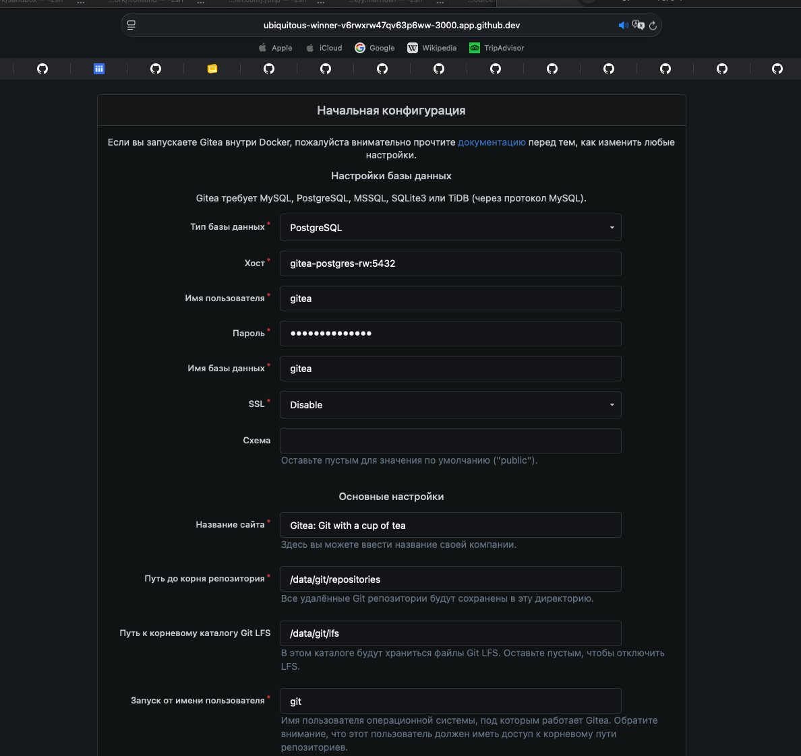
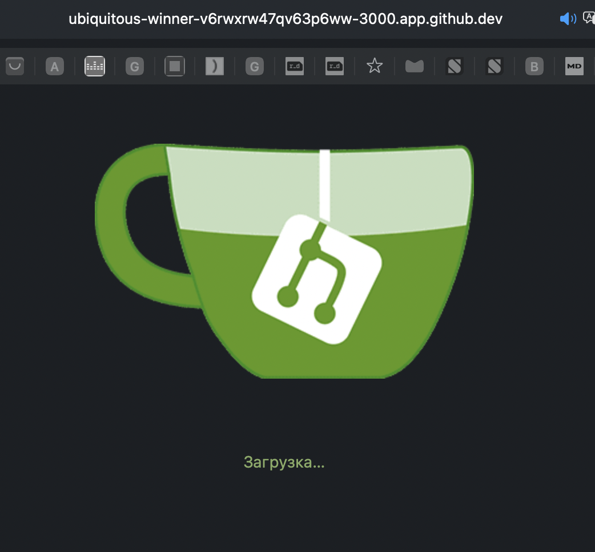
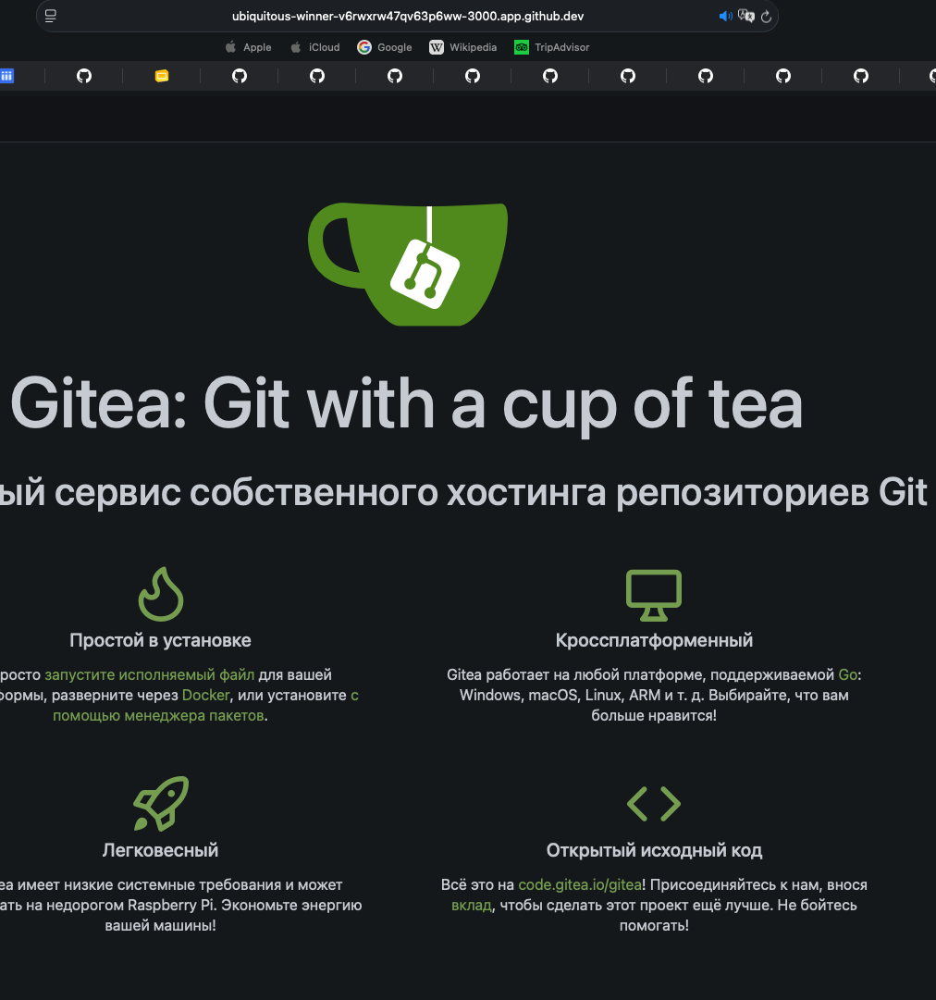

# Курсовий проєкт: Docker & Kubernetes

## Опис проєкту

У цьому проєкті розгортається self-hosted Git-сервіс **Gitea** у Kubernetes кластері.

Проєкт реалізований за GitOps-підходом з використанням **FluxCD**. Уся інфраструктура описана як код у Git-репозиторії. Будь-яка зміна в репозиторії автоматично синхронізується з Kubernetes-кластером без ручного `kubectl apply`.

---

# Технології

- Docker
- Kubernetes
- Helm
- FluxCD
- CloudNativePG Operator
- PostgreSQL
- Gitea
- NGINX Ingress Controller
- HPA
- kind

---

# Архітектура

Застосунок: **Gitea**  
База даних: **PostgreSQL**  
Оператор бази даних: **CloudNativePG**

| Environment | Namespace | Replicas | Database | Ingress |
|---|---|---:|---|---|
| staging | staging | 1 | PostgreSQL single instance | gitea.staging.local |
| production | production | HPA 2-5 | PostgreSQL production config | gitea.local |

---

# 1. Встановлення необхідних інструментів

## Docker

```bash
docker --version
Docker version 29.3.0-1, build 5927d80c76b3ce5cf782be818922966e8a0d87a3
```

## kubectl

```bash
kubectl version --client
Client Version: v1.35.2
Kustomize Version: v5.7.1
```

## Helm

```bash
helm version
version.BuildInfo{Version:"v4.1.1", GitCommit:"5caf0044d4ef3d62a955440272999e139aafbbed", GitTreeState:"clean", GoVersion:"go1.25.7", KubeClientVersion:"v1.35"}
```

## Flux CLI

```bash
flux --version
flux version 2.8.8
```

## kind

```bash
kind version
kind v0.29.0 go1.24.2 linux/amd64
```

---

# 2. Створення Kubernetes-кластера

Файл `kind-cluster.yaml`:

```yaml
kind: Cluster
apiVersion: kind.x-k8s.io/v1alpha4
name: course-project
nodes:
  - role: control-plane
    extraPortMappings:
      - containerPort: 80
        hostPort: 80
        protocol: TCP
      - containerPort: 443
        hostPort: 443
        protocol: TCP
```

Створення кластера:

```bash
kind create cluster --config kind-cluster.yaml
```

Результат:

```bash
Creating cluster "course-project" ...
 ✓ Ensuring node image (kindest/node:v1.33.1) 🖼
 ✓ Preparing nodes 📦
 ✓ Writing configuration 📜
 ✓ Starting control-plane 🕹️
 ✓ Installing CNI 🔌
 ✓ Installing StorageClass 💾
Set kubectl context to "kind-course-project"
```

Перевірка:

```bash
kubectl get nodes
NAME                           STATUS   ROLES           AGE   VERSION
course-project-control-plane   Ready    control-plane   40m   v1.33.1
```

---

# 3. Встановлення Ingress Controller

Встановлення NGINX Ingress Controller:

```bash
kubectl apply -f https://raw.githubusercontent.com/kubernetes/ingress-nginx/main/deploy/static/provider/kind/deploy.yaml
```

Очікування готовності:

```bash
kubectl wait --namespace ingress-nginx \
  --for=condition=ready pod \
  --selector=app.kubernetes.io/component=controller \
  --timeout=180s
```

Перевірка:

```bash
kubectl get pods -n ingress-nginx
NAME                                       READY   STATUS    RESTARTS   AGE
ingress-nginx-controller-7b887fdf8-z4m9c   1/1     Running   0          39m
```

---

# 4. Підготовка локальних доменів

```bash
sudo sh -c 'echo "127.0.0.1 gitea.staging.local" >> /etc/hosts'
sudo sh -c 'echo "127.0.0.1 gitea.local" >> /etc/hosts'
```

---

# 5. Структура репозиторію

```text
course-project-Yevhen-Marholin/
├── README.md
├── kind-cluster.yaml
├── charts/
│   └── gitea-app/
│       ├── Chart.yaml
│       ├── values.yaml
│       └── templates/
│           ├── deployment.yaml
│           ├── service.yaml
│           ├── ingress.yaml
│           ├── secret.yaml
│           └── hpa.yaml
├── infrastructure/
│   ├── operators/
│   │   └── cloudnative-pg/
│   │       ├── namespace.yaml
│   │       ├── helmrepository.yaml
│   │       ├── helmrelease.yaml
│   │       └── kustomization.yaml
│   └── databases/
│       ├── staging-postgres.yaml
│       ├── production-postgres.yaml
│       └── kustomization.yaml
└── clusters/
    ├── kustomization.yaml
    ├── flux-system/
    │   ├── gotk-components.yaml
    │   ├── gotk-sync.yaml
    │   └── kustomization.yaml
    ├── staging/
    │   ├── namespace.yaml
    │   ├── helmrelease.yaml
    │   └── kustomization.yaml
    └── production/
        ├── namespace.yaml
        ├── helmrelease.yaml
        └── kustomization.yaml
```

---

# 6. Ініціалізація FluxCD

```bash
flux bootstrap github \
  --owner=YevhenMarholin \
  --repository=course-project-Yevhen-Marholin \
  --branch=main \
  --path=./clusters \
  --personal
```

Результат:

```bash
► connecting to github.com
✔ cloned repository
✔ generated component manifests
✔ installed components
✔ reconciled components
✔ configured deploy key
✔ reconciled sync configuration
✔ GitRepository reconciled successfully
✔ Kustomization reconciled successfully
✔ all components are healthy
```

Перевірка Flux:

```bash
flux check
```

Результат:

```bash
► checking prerequisites
✔ Kubernetes 1.33.1 >=1.33.0-0
► checking version in cluster
✔ distribution: flux-v2.8.8
✔ bootstrapped: true
► checking controllers
✔ helm-controller: deployment ready
✔ kustomize-controller: deployment ready
✔ notification-controller: deployment ready
✔ source-controller: deployment ready
✔ all checks passed
```

---

# 7. CloudNativePG Operator

CloudNativePG встановлюється через Flux `HelmRelease`.

## infrastructure/operators/cloudnative-pg/namespace.yaml

```yaml
apiVersion: v1
kind: Namespace
metadata:
  name: cnpg-system
```

## infrastructure/operators/cloudnative-pg/helmrepository.yaml

```yaml
apiVersion: source.toolkit.fluxcd.io/v1
kind: HelmRepository
metadata:
  name: cloudnative-pg
  namespace: flux-system
spec:
  interval: 1h
  url: https://cloudnative-pg.github.io/charts
```

## infrastructure/operators/cloudnative-pg/helmrelease.yaml

```yaml
apiVersion: helm.toolkit.fluxcd.io/v2
kind: HelmRelease
metadata:
  name: cloudnative-pg
  namespace: flux-system
spec:
  interval: 10m
  targetNamespace: cnpg-system
  chart:
    spec:
      chart: cloudnative-pg
      version: "*"
      sourceRef:
        kind: HelmRepository
        name: cloudnative-pg
        namespace: flux-system
      interval: 1h
```

## infrastructure/operators/cloudnative-pg/kustomization.yaml

```yaml
apiVersion: kustomize.config.k8s.io/v1beta1
kind: Kustomization
resources:
  - namespace.yaml
  - helmrepository.yaml
  - helmrelease.yaml
```

---

# 8. PostgreSQL через CloudNativePG Operator

Використання plain-text StatefulSet або Deployment для бази даних не застосовується. PostgreSQL створюється через Custom Resource `Cluster`, який надає CloudNativePG Operator.

## clusters/staging/namespace.yaml

```yaml
apiVersion: v1
kind: Namespace
metadata:
  name: staging
```

## clusters/production/namespace.yaml

```yaml
apiVersion: v1
kind: Namespace
metadata:
  name: production
```

## infrastructure/databases/staging-postgres.yaml

```yaml
apiVersion: postgresql.cnpg.io/v1
kind: Cluster
metadata:
  name: gitea-postgres
  namespace: staging
spec:
  instances: 1

  storage:
    size: 1Gi

  bootstrap:
    initdb:
      database: gitea
      owner: gitea
      secret:
        name: gitea-db-secret
```

## infrastructure/databases/production-postgres.yaml

```yaml
apiVersion: postgresql.cnpg.io/v1
kind: Cluster
metadata:
  name: gitea-postgres
  namespace: production
spec:
  instances: 1

  storage:
    size: 2Gi

  resources:
    requests:
      memory: 512Mi
      cpu: 250m
    limits:
      memory: 1Gi
      cpu: 500m

  bootstrap:
    initdb:
      database: gitea
      owner: gitea
      secret:
        name: gitea-db-secret
```

## infrastructure/databases/kustomization.yaml

```yaml
apiVersion: kustomize.config.k8s.io/v1beta1
kind: Kustomization
resources:
  - staging-postgres.yaml
  - production-postgres.yaml
```

---

# 9. Helm Chart для Gitea

## charts/gitea-app/Chart.yaml

```yaml
apiVersion: v2
name: gitea-app
description: Gitea application Helm chart for course project
type: application
version: 0.1.0
appVersion: "1.22"
```

## charts/gitea-app/values.yaml

```yaml
replicaCount: 1

image:
  repository: gitea/gitea
  tag: "1.22"
  pullPolicy: IfNotPresent

service:
  type: ClusterIP
  port: 3000

ingress:
  enabled: true
  className: nginx
  host: gitea.local

resources: {}

database:
  host: gitea-postgres-rw
  port: 5432
  name: gitea
  user: gitea
  password: gitea-password

hpa:
  enabled: false
  minReplicas: 2
  maxReplicas: 5
  cpuUtilization: 70
```

## charts/gitea-app/templates/secret.yaml

```yaml
apiVersion: v1
kind: Secret
metadata:
  name: gitea-db-secret
type: Opaque
stringData:
  username: {{ .Values.database.user | quote }}
  password: {{ .Values.database.password | quote }}
```

## charts/gitea-app/templates/deployment.yaml

```yaml
apiVersion: apps/v1
kind: Deployment
metadata:
  name: {{ .Release.Name }}
  labels:
    app: {{ .Release.Name }}
spec:
  replicas: {{ .Values.replicaCount }}
  selector:
    matchLabels:
      app: {{ .Release.Name }}
  template:
    metadata:
      labels:
        app: {{ .Release.Name }}
    spec:
      containers:
        - name: gitea
          image: "{{ .Values.image.repository }}:{{ .Values.image.tag }}"
          imagePullPolicy: {{ .Values.image.pullPolicy }}
          ports:
            - containerPort: 3000
          env:
            - name: GITEA__database__DB_TYPE
              value: postgres
            - name: GITEA__database__HOST
              value: "{{ .Values.database.host }}:{{ .Values.database.port }}"
            - name: GITEA__database__NAME
              value: {{ .Values.database.name | quote }}
            - name: GITEA__database__USER
              valueFrom:
                secretKeyRef:
                  name: gitea-db-secret
                  key: username
            - name: GITEA__database__PASSWD
              valueFrom:
                secretKeyRef:
                  name: gitea-db-secret
                  key: password
          resources:
{{ toYaml .Values.resources | indent 12 }}
```

## charts/gitea-app/templates/service.yaml

```yaml
apiVersion: v1
kind: Service
metadata:
  name: {{ .Release.Name }}
spec:
  type: {{ .Values.service.type }}
  selector:
    app: {{ .Release.Name }}
  ports:
    - name: http
      port: {{ .Values.service.port }}
      targetPort: 3000
```

## charts/gitea-app/templates/ingress.yaml

```yaml
{{- if .Values.ingress.enabled }}
apiVersion: networking.k8s.io/v1
kind: Ingress
metadata:
  name: {{ .Release.Name }}
spec:
  ingressClassName: {{ .Values.ingress.className }}
  rules:
    - host: {{ .Values.ingress.host }}
      http:
        paths:
          - path: /
            pathType: Prefix
            backend:
              service:
                name: {{ .Release.Name }}
                port:
                  number: {{ .Values.service.port }}
{{- end }}
```

## charts/gitea-app/templates/hpa.yaml

```yaml
{{- if .Values.hpa.enabled }}
apiVersion: autoscaling/v2
kind: HorizontalPodAutoscaler
metadata:
  name: {{ .Release.Name }}
spec:
  scaleTargetRef:
    apiVersion: apps/v1
    kind: Deployment
    name: {{ .Release.Name }}
  minReplicas: {{ .Values.hpa.minReplicas }}
  maxReplicas: {{ .Values.hpa.maxReplicas }}
  metrics:
    - type: Resource
      resource:
        name: cpu
        target:
          type: Utilization
          averageUtilization: {{ .Values.hpa.cpuUtilization }}
{{- end }}
```

---

# 10. Flux environments

## clusters/staging/helmrelease.yaml

```yaml
apiVersion: helm.toolkit.fluxcd.io/v2
kind: HelmRelease
metadata:
  name: gitea
  namespace: staging
spec:
  interval: 5m
  chart:
    spec:
      chart: ./charts/gitea-app
      sourceRef:
        kind: GitRepository
        name: flux-system
        namespace: flux-system
  values:
    replicaCount: 1
    ingress:
      host: gitea.staging.local
    resources: {}
    hpa:
      enabled: false
```

## clusters/staging/kustomization.yaml

```yaml
apiVersion: kustomize.config.k8s.io/v1beta1
kind: Kustomization
resources:
  - namespace.yaml
  - ../../infrastructure/databases
  - helmrelease.yaml
```

## clusters/production/helmrelease.yaml

```yaml
apiVersion: helm.toolkit.fluxcd.io/v2
kind: HelmRelease
metadata:
  name: gitea
  namespace: production
spec:
  interval: 5m
  chart:
    spec:
      chart: ./charts/gitea-app
      sourceRef:
        kind: GitRepository
        name: flux-system
        namespace: flux-system
  values:
    replicaCount: 2
    ingress:
      host: gitea.local
    resources:
      requests:
        cpu: 200m
        memory: 256Mi
      limits:
        cpu: 500m
        memory: 512Mi
    hpa:
      enabled: true
      minReplicas: 2
      maxReplicas: 5
      cpuUtilization: 70
```

## clusters/production/kustomization.yaml

```yaml
apiVersion: kustomize.config.k8s.io/v1beta1
kind: Kustomization
resources:
  - namespace.yaml
  - helmrelease.yaml
```

## clusters/kustomization.yaml

```yaml
apiVersion: kustomize.config.k8s.io/v1beta1
kind: Kustomization
resources:
  - flux-system
  - staging
  - production
```

---

# 11. GitOps sync

Після створення або зміни файлів потрібно виконати commit та push:

```bash
git add .
git commit -m "Add Gitea application with PostgreSQL operator"
git push origin main
```

Примусова синхронізація Flux:

```bash
flux reconcile kustomization flux-system -n flux-system --with-source
► annotating GitRepository flux-system in flux-system namespace
✔ GitRepository annotated
◎ waiting for GitRepository reconciliation
✔ fetched revision main@sha1:6c2d7ef766504f4a988bc7849f99d5ec1092f9bf
► annotating Kustomization flux-system in flux-system namespace
✔ Kustomization annotated
◎ waiting for Kustomization reconciliation
✔ applied revision main@sha1:6c2d7ef766504f4a988bc7849f99d5ec1092f9bf
```

---

# 12. Перевірка роботи

## HelmRelease

```bash
flux get helmreleases -A

```

Результат:

```text
lux get helmreleases -A
NAMESPACE       NAME    REVISION        SUSPENDED       READY   MESSAGE                                                                           
production      gitea   0.1.0           False           True    Helm install succeeded for release production/gitea.v1 with chart gitea-app@0.1.0
staging         gitea   0.1.0           False           True    Helm install succeeded for release staging/gitea.v1 with chart gitea-app@0.1.0  
```

## Kustomizations

```bash
flux get kustomizations -A
```

Результат:

```text
flux-system     flux-system     main@sha1:6c2d7ef7      False           True    Applied revision: main@sha1:6c2d7ef7
```

## Pods

```bash
kubectl get pods -A
```

Результат:

```text
production           gitea-6cdc48f4d9-mh2gh          1/1     Running
production           gitea-6cdc48f4d9-t8btd          1/1     Running
staging              gitea-cd6dbcb55-tmq7x           1/1     Running
```

## PostgreSQL clusters

```bash
kubectl get clusters.postgresql.cnpg.io -A
```

Результат:

```text
NAMESPACE    NAME             AGE     INSTANCES   READY   STATUS               PRIMARY
production   gitea-postgres   3m15s   1                   Cluster in healthy state   gitea-postgres-1
staging      gitea-postgres   3m15s                       Cluster in healthy state   gitea-postgres-1
```

## Ingress

```bash
kubectl get ingress -A
```

Результат:

```text
NAMESPACE    NAME    CLASS   HOSTS                 ADDRESS     PORTS   AGE
production   gitea   nginx   gitea.local           localhost   80      3m35s
staging      gitea   nginx   gitea.staging.local   localhost   80      3m34s
```

## HPA

```bash
kubectl get hpa -A
```

Результат:

```text
NAMESPACE    NAME    REFERENCE          TARGETS   MINPODS   MAXPODS   REPLICAS   AGE
production   gitea   Deployment/gitea   0%/70%    2         5         2          1m
```

---

# 13. Перевірка доступу до застосунку

Staging:

```bash
curl http://gitea.staging.local
<!DOCTYPE html>
<html lang="en-US">
<title>Installation - Gitea: Git with a cup of tea</title>
```

Production:

```bash
curl http://gitea.local
<!DOCTYPE html>
<html lang="en-US">
<title>Installation - Gitea: Git with a cup of tea</title>

```

Також застосунок можна відкрити у браузері:

```text
http://gitea.staging.local
http://gitea.local


```

---

# 14. Self-Healing перевірка

Видаляємо deployment вручну:

```bash
kubectl delete deployment gitea -n staging
```

Flux автоматично відновлює ресурс:

```bash
kubectl get deployment -n staging
gitea   1/1     1            1           3m8s
```

Примусова синхронізація:

```bash
flux reconcile kustomization flux-system -n flux-system --with-source
 annotating GitRepository flux-system in flux-system namespace
✔ GitRepository annotated
◎ waiting for GitRepository reconciliation
✔ fetched revision main@sha1:4d102e8eb8adbee89f499471ab7d3c3bb82841bc
► annotating Kustomization flux-system in flux-system namespace
✔ Kustomization annotated
◎ waiting for Kustomization reconciliation
✔ applied revision main@sha1:4d102e8eb8adbee89f499471ab7d3c3bb82841bc
```

---

# 15. Результат роботи

У результаті було реалізовано:

- створення Kubernetes кластера через kind
- встановлення NGINX Ingress Controller
- ініціалізація FluxCD
- GitOps-підхід до доставки інфраструктури
- встановлення CloudNativePG Operator через Flux HelmRelease
- створення PostgreSQL бази даних через Custom Resource
- створення власного Helm chart для Gitea
- staging середовище
- production середовище
- Ingress для обох середовищ
- HPA для production
- self-healing через FluxCD

---
